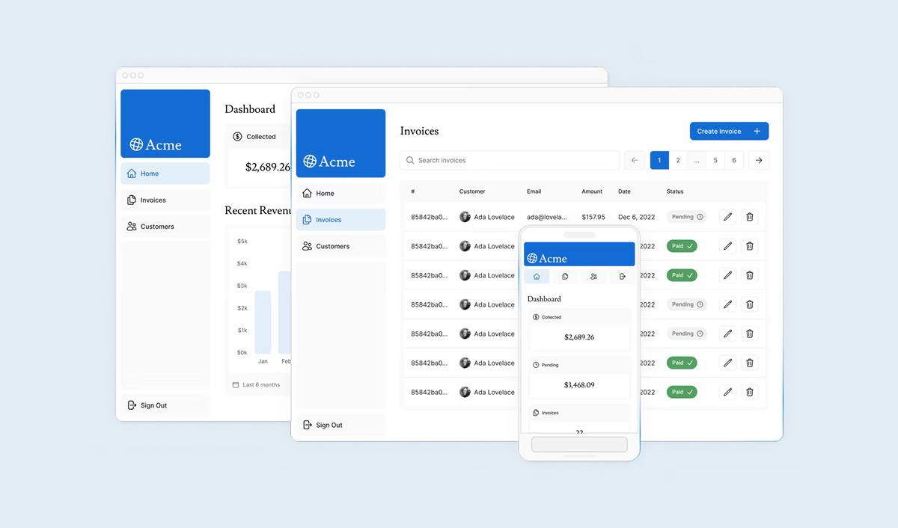

# Acme Dashboard

Een full-stack dashboard voor factuurbeheer, gebouwd met Next.js App Router. Houdt klanten, facturen en omzet bij voor een fictief bedrijf genaamd Acme.

Live: [start-building-with-next-js.vercel.app](https://start-building-with-next-js.vercel.app/)



## Functies

- **Authenticatie** — inloggen op basis van inloggegevens via NextAuth v5
- **Dashboardoverzicht** — omzetgrafiek, laatste facturen en samenvatting cards
- **Facturen** — facturen aanmaken, bewerken en verwijderen met server-side validatie
- **Klanten** — klanten bekijken met geaggregeerde factuurtotalen
- **Zoeken & paginering** — URL-gebaseerd, werkt met server components
- **Responsieve layout** — zijnavigatie klapt in tot een mobiele onderste navigatiebalk
- **Laadstatussen** — skeleton UI via React Suspense streaming

## Techstack

- [Next.js](https://nextjs.org) (App Router, Turbopack)
- [TypeScript](https://www.typescriptlang.org)
- [Tailwind CSS](https://tailwindcss.com)
- [PostgreSQL](https://www.postgresql.org) via het `postgres`-package
- [NextAuth v5](https://authjs.dev) — credentials provider
- [Zod](https://zod.dev) — validatie van formulieren en server actions
- [bcrypt](https://github.com/kelektiv/node.bcrypt.js) — wachtwoord-hashing

## Aan de slag

**Vereisten:** Node.js 18+, pnpm, een PostgreSQL-database

1. Installeer de dependencies:

   ```bash
   pnpm install
   ```

2. Stel de omgevingsvariabelen in — kopieer `.env.example` naar `.env` en vul aan:

   ```
   POSTGRES_URL=
   AUTH_SECRET=
   ```

3. Vul de database met testdata:

   ```
   GET /seed
   ```

4. Start de dev server:
   ```bash
   pnpm dev
   ```

Open [http://localhost:3000](http://localhost:3000) en log in met je aangemaakte inloggegevens.

## Projectstructuur

```
app/
├── dashboard/
│   ├── (overview)/     # Dashboard-startpagina met omzet- en factuuroverzicht
│   ├── invoices/       # Factuurlijst, aanmaak- en bewerkpagina's
│   └── customers/      # Klantenlijstpagina
├── login/              # Inlogpagina
├── lib/
│   ├── actions.tsx     # Server actions (facturen aanmaken/bijwerken/verwijderen, auth)
│   ├── data.ts         # Functies voor databasequery's
│   └── definitions.ts  # Gedeelde TypeScript-types
└── ui/                 # Gedeelde componenten (navigatie, kaarten, formulieren, skeletons)
```
